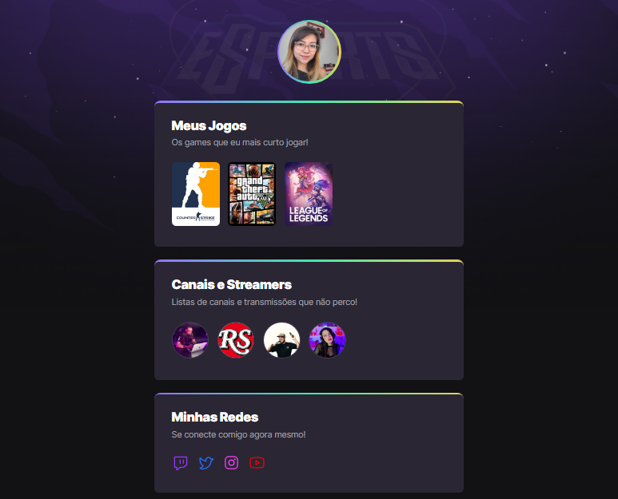

# NLW eSports 🚀

> Trilha Explorer 🧐

Projeto construído no evento Next Level Week Rocketseat, com animações feitas em CSS.

[Clique aqui para acessar!!👈](https://tiemi9.github.io/NLW-eSports/)

## 📡 Tecnologias

- HTML,
- CSS,
-  Git e GitHub 
##  💻 Contato

https://www.linkedin.com/in/cristiemim9

 🎉 Agradecimentos 
##### À toda equipe da Rocketseat, e principalmete à Mayk Britto, educador, que nos acompanhou durante esse evento. Realizar esse projeto com a Rocketseat bem interessante! Obrigada!! E bora decolar! 🚀